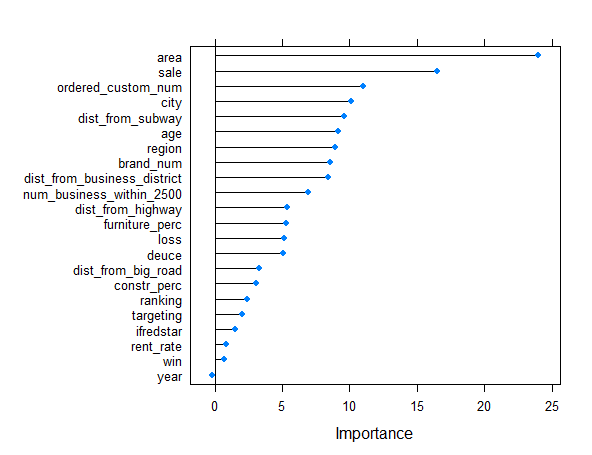

```{r setup, include=FALSE}
knitr::opts_chunk$set(echo = FALSE)
```

##一 业务理论基础

- 租金水平类比法
通过考虑区域内其他对手的租金以及商圈的整体水平估计租金
- 保本保利定价法
以厂商的租金承受能力为基础，分析典型业种在一定成本下的损益平衡点。只有多数厂商能够赢利，购物中心才能稳定与发展。
- 投资收益分析法
以目前的销售水平推算预期实现的租金水平。
- 自身成本定价法
以项目的投资成本为基础，按静态回报率推算项目租金均价,从我们自身出发
- 特征价格法
把商铺看作商品,根据商品及其环境的各项特性(区位,经济指标,内部结构)与其价格(租金)进行数学建模

##二 机器学习方法

1. 加入了约束的线性回归
2. 决策树
3. SVM支持向量机
4. 神经网格

##三 数据收集(一)
####红星自身数据
采集精细的可靠的数据，这部分数据相对好获取，但也存在问题：销售数据不准，没有停车数据，缺部分大商场数据（深圳），数据年份过短，数据流没有做到标准化，有些数据没有统计：盈亏比例，展位数字地图，A类品牌占比

####竞争对手数据
问题主要在于有些数据获取不到，有些数据能拿到但太粗或者不准确，数据提供格式不利于处理，此外收集数据缺乏统一标准和组织，因标准不一造成清洗困难，部分名词含义不明确理解有歧义（举个例子，居然之家有好多店，只写居然之家无法判断是哪个店），收集的数据组织缺乏导致过于集中在某个领域某个维度，不具备代表性，一旦研究对象增多，工作量极大，也需要提供更好共享方式


##数据收集(二)
####百度谷歌等免费API
主要用于地图类数据的获取，包括百度地图,有道翻译，谷歌地图，已经形成比较高效的数据流，但是准确性还不能达到极高精度，这跟地址，经纬度不准确，名字有歧义都有关系

####数据爬取
这里通过爬取大众点评网得到了全国十个需研究城市的商圈方位信息，后续可加入商圈大小信息

####外部数据源
目前并没有有效的外部数据源支持，曾有人提供道路网数据，可大大增加准确度，减少工作量,但因成本问题未能引入

####人工网上收集
竞争对手商场的很多数据主要通过手工采集，并没有很好的办法

##数据收集(三)
####运算改进
丢弃影响因素小变量：之前曾经选择使用商场所处位置在十字路口一角，还是在路边，还是不靠路，后来发现该变量影响很小，本次未统计    
变量计算方法优化：各个交通特征都在本次采取了更迅速，更合理，更自动化，更全面的采集方式

####特征选择   
商场内部特征：面积，商场年龄，品牌结构信息，销售金额，用户订单数    
宏观经济特征：人口，gdp,人均可支配收入    
区位交通特征：与高速距离，与地铁距离，与最近道路距离    
区位经济特征：与商圈距离，与市中心距离，周边小区状况    

##四 数据清洗
####格式转换
一开始给的是pdf格式的数据，用程序解析后非常乱，需要很多时间整理

####统一度量
有的地方用月统计，有的地方用年统计，有的地方统计百分比，有的地方统计绝对数目，日期格式，资金格式，太多不一致，需要大量时间统一

####合并数据
需要将不同地方采集的数据统一在一起

##数据清洗
```{r total3, echo = FALSE}
library(knitr)
total3 = readxl::read_xlsx("total3.xlsx")
kable(total3[1:5,c("mall_name","ranking","rent","sale","furniture_perc")],caption = "清洗后的表格")
```

##数据预处理(一) 缺失值处理
*简单平均法 聚类法 线性非线性插值 决策树 多重插值*
```{r total6, echo = FALSE}
total6 = readxl::read_xlsx("total6.xlsx")
kable(total6[1:5,c("mall_name","ranking","rent","sale","furniture_perc")])
```


##数据预处理(二) 变量重要度排序

[^1]: 注意变量重要程度低不一定代表变量不重要，因为有的变量缺失值很多！

##数据预处理(三) 区域划分


##结果展示(一)

```{r result1, echo = FALSE}
library(knitr)
library(xtable)
first_result = readxl::read_xlsx("result_compare_delicate.xlsx")
kable(first_result[c(6,7,8,12,13,15,16),1:7],format = "markdown")
```

##结果展示(二)
```{r result2, echo = FALSE}
library(knitr)
library(xtable)
kable(first_result[c(17,18,19),1:7],format = "markdown")
```

##结果展示(三)

```{r result3, echo = FALSE}
second_result = readxl::read_xlsx("result_compare2.xlsx")
kable(second_result[c(14,18,19,8),])
```

##问题和努力方向
1. 对于新开的商场的估计并不准确
2. 需要自己商场更完善的数据，比如深圳的数据，我们自己的盈亏比数据，停车场等人流量数据
3. 需要竞争对手的数据，销售，租金，各品牌比例等，而且极度需要标准化和规范
4. 需要更好的拿到一些外部数据源的支持