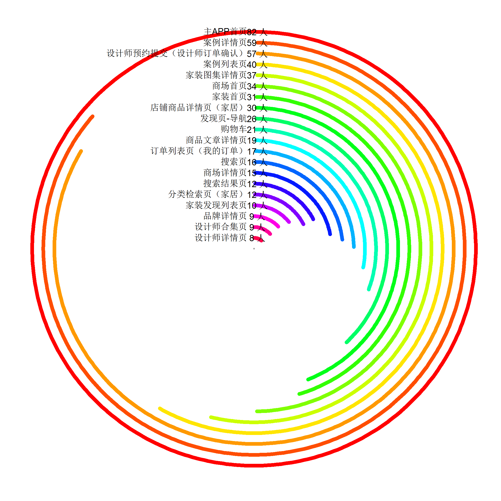
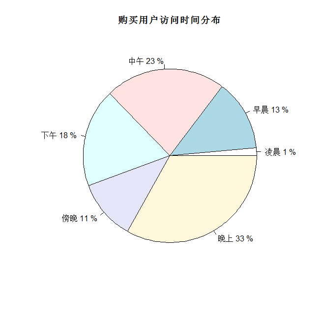

```{r}
library(data.table)
library(D3partitionR)
library(readr)
library(readxl)
tb_3 = data.table(read_xlsx('~/data/tb3.xlsx'))
tb_4 = tb_3[sumvalue<=30,]
tb_5 = tb_3[sumvalue>30,]
# D3partitionR(data=list(path=tb_4$page_name,value=1),type = 'sunburst')
```
上面是部分代码


```{r, echo=FALSE}
library(sunburstR)
# temp = read_xlsx('~/data/temp.xlsx')
# temp2=data.table(path=temp$behaviour.behaviour,value=1)
# sunburst(temp2)
behavior05140 = read_xlsx('~/data/behavior05140_copy.xlsx')
page_view_potential_buyer = read_xlsx('~/data/page_view_potential_buyer.xlsx')
temp = read_xlsx('~/data/temp.xlsx')
temp3 = merge(temp,page_view_potential_buyer,by = 'username')
temp4 = merge(page_view_potential_buyer,behavior05140,by = 'username')
temp4 = data.table(temp4)
temp3 = data.table(temp3)
temp4[,value:=1]
temp5 = temp4[,.(sumvalue = sum(value)),by = 'username']
temp6 = temp5[sumvalue<50,username]
temp6 = temp5[sumvalue>50,username]
temp7 = temp3[!(username %in% temp6),]
temp2=data.table(path=temp7$page_name,value=1)
sunburst(temp2)
```
以上是购买用户路径图
从路径图可以看到，有潜在购买欲的用户的行为比较多元化，比较复杂
很多有购买倾向的用户会在案例列表，案例详情页面来回徘徊数十次
还有部分用户则非常直接，进入订单确认页，应该是已经得到足够的情报，使用APP来下单

```{r, echo=FALSE}
# df0514 = read_xlsx('~/data/df0514.xlsx')
# page_buyer_wide = merge(page_view_potential_buyer,df0514,by.x = 'username',by.y = 'i.u_mid')
# page_buyer_wide = data.table(page_buyer_wide)
# page_buyer_wide[,value:=1]
page_buyer_wide1 = read_xlsx('~/data/page_buyer_wide1.xlsx')
page_buyer_wide1 = data.table(page_buyer_wide1)
page_buyer_stat1 = page_buyer_wide1[,.(sumvalue = sum(value)),by = 'username']
page_buyer_stat1_cut = cut(page_buyer_stat1$sumvalue,breaks = c(1,20,10000))
page_buyer_stat1_table = table(page_buyer_stat1_cut)
names(page_buyer_stat1_table) = c('buyer view page<20','buyer view page>20')
barplot(page_buyer_stat1_table,col=c('blue','red'))
```



一共有88个用户，可以看出，除了各大首页以及购物车订单页外，家装图集详情页以及案例列表，案例详情，商场详情，搜索，搜索结果等会被潜在购买者经常关注




可以看出，对于有支付行为的用户而言，其浏览行为大多产生于傍晚时间，其次是中午
(凌晨：0点到7点，早晨：7点到11点，中午：11点到3点，下午：3点到6点，傍晚：6点到9点，晚上：9点到12点)

